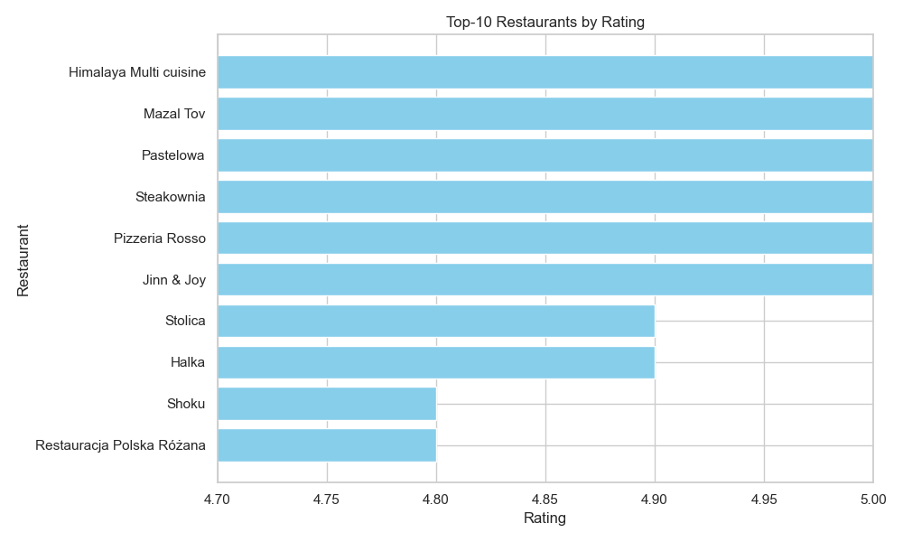
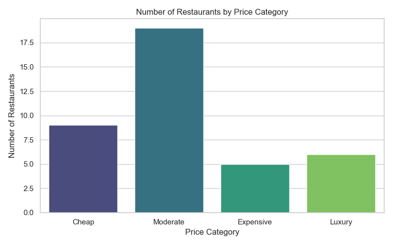

# Restaurant Data Analysis with Yelp API

This project explores restaurant data in Warsaw using the Yelp Fusion API. It covers the full pipeline — from data collection and storage to SQL analysis and interactive visualizations in Tableau.

---

## Project Structure

Restaurant-Data-Analysis/
├── yelp_scraper.py                    # Collects restaurant data from Yelp API
├── to_sqlite.py                       # Saves data into a local SQLite database
├── analysis_queries.py                # Runs SQL queries and prints insights
├── warsaw_restaurants.csv             # Original dataset in CSV format
├── restaurants.db                     # SQLite database file
├── top_10_restaurants.csv             # Top-rated restaurants (for Tableau)
├── restaurants_by_price.csv           # Distribution by price category (for Tableau)
├── average_rating_by_category.csv     # Average rating by cuisine (for Tableau)
├── restaurants_by_district.csv        # Number of restaurants per district (for Tableau)
├── plots/
│   ├── plot_top10_rating.png
│   ├── plot_by_price.png
│   ├── plot_avg_rating_by_category.png
│   └── plot_restaurants_by_district.png
├── .env                               # API key (not included in the repo)
├── .gitignore                         # Ignores .env and .db files
└── README.md                          # Project description


---

## Technologies Used

- **Python**: for data collection and transformation
- **SQLite**: for structured data storage and SQL querying
- **Pandas**: for data manipulation
- **Tableau**: for interactive data visualization
- **Yelp Fusion API**: for real-world restaurant data

---

## Features

- Fetches real restaurant data from Yelp for a specific city (Warsaw)
- Saves and structures data in a local SQLite database
- Performs analytical SQL queries:
  - Top-rated restaurants
  - Number of restaurants by price level
  - Average rating by cuisine category
  - Distribution of restaurants across Warsaw districts
- Prepares CSV files for visualization in Tableau

---

## Visualizations (Python)

The following charts were generated using `Matplotlib` and `Seaborn` based on the analyzed restaurant data.

### Top-10 Restaurants by Rating



### Number of Restaurants by Price Category



### Average Rating by Category


### Restaurants by District


---

## Visualizations in Tableau

View the full interactive dashboard on Tableau Public:  
[[Warsaw Restaurant Analysis on Tableau Public]](https://public.tableau.com/views/RestaurantDataAnalysis_17437985621010/Sheet4?:language=en-US&publish=yes&:sid=&:redirect=auth&:display_count=n&:origin=viz_share_link)

You can find insights like:

- Top 10 restaurants in Warsaw
- Restaurant counts by price tier
- Average ratings by cuisine type
- Restaurant distribution by district (ZIP → Region mapping)

> Visualizations created using Tableau Public.

---

## Setup Instructions

1. Clone the repository:
   ```bash
   git clone https://github.com/flamesaria/Restaurant-Data-Analysis.git
   cd Restaurant-Data-Analysis

2. Install required packages
   ```bash
   pip install requests pandas python-dotenv

3. Create a .env file and add your Yelp API key
   ```bash
   YELP_API_KEY=your_api_key

4. Run the scraper
   ```bash
   python yelp_scraper.py

5. Save to SQLite
   ```bash
   python to_sqlite.py

6. Run analysis and export CSVs for Tableau
    ```bash
   python analysis_queries.py

7. Visualize in Tableau
   Open Tableau and load the CSVs:
   - top_10_restaurants.csv
   - restaurants_by_price.csv
   - average_rating_by_category.csv
   - restaurants_by_district.csv
   Create dashboards, charts, or maps


## Author
Darya
@flamesaria

## License
This project is for educational and personal use. Please follow Yelp’s API terms of service when using their data.


